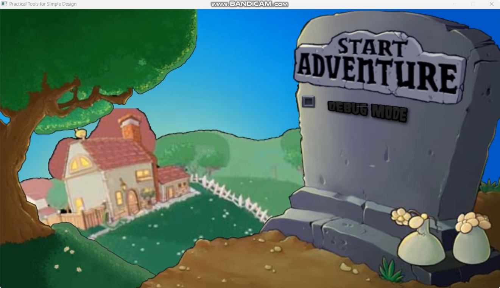
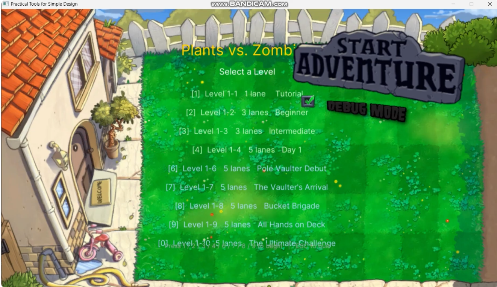
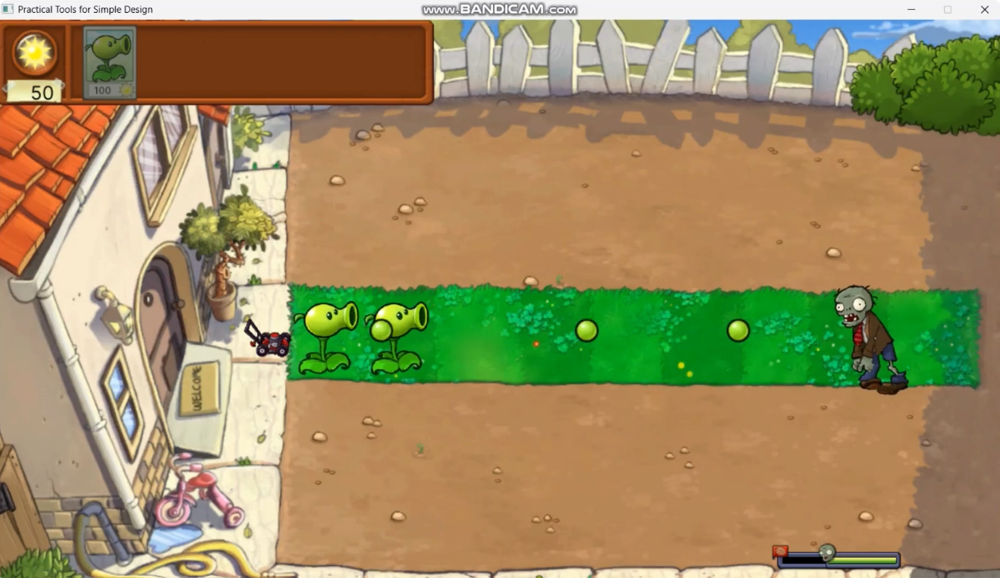
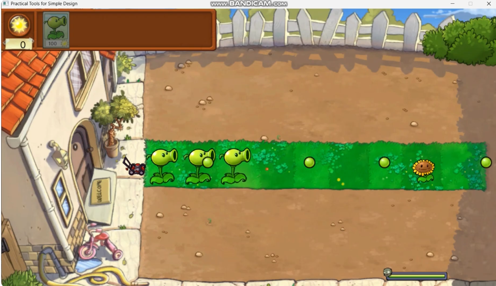
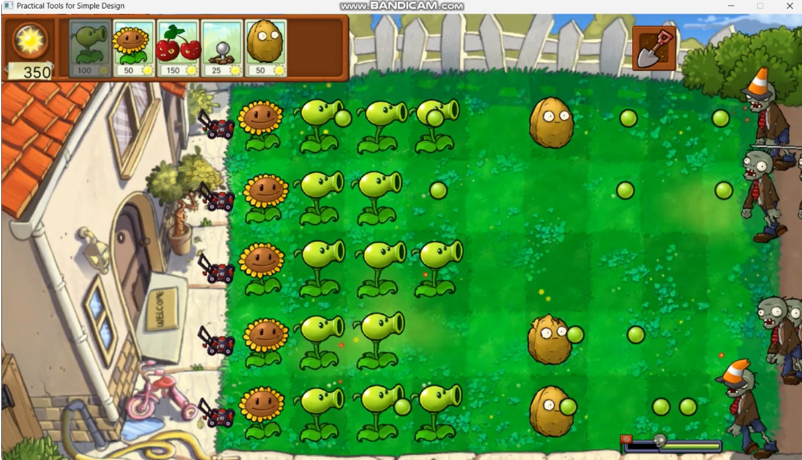
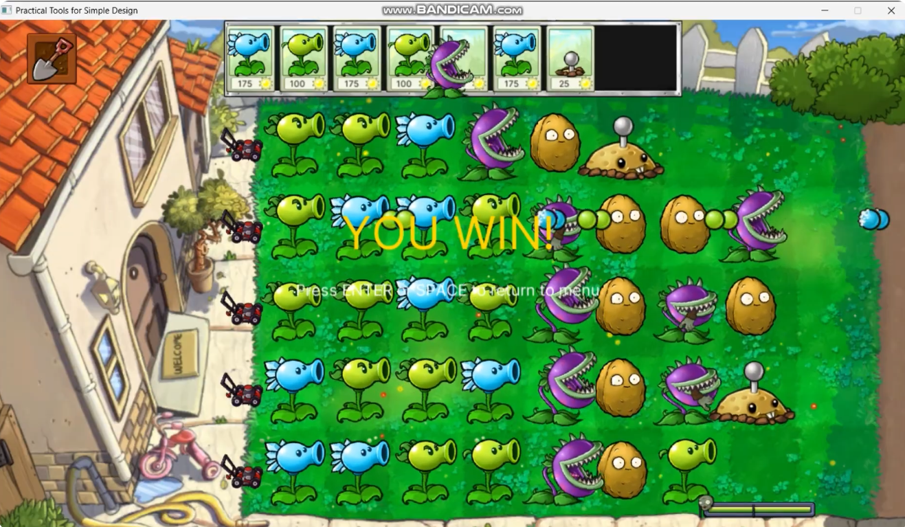

# 2026 OOPL Final Report

## Group Information

- **Group Number: T18** 
- **Members: 113590036 蘇玫人** 
- **Replicated Game: Plant vs. Zombie** 

---

## Project Overview

### Game Introduction
This project recreates the Day stages of Plants vs. Zombies, a tower defense game developed by PopCap Games. In the game, players defend their house from waves of approaching zombies by strategically placing different types of plants, each with unique abilities. Sun serves as the primary resource and must be collected and managed carefully to deploy plants effectively.

The recreated version focuses on the Day levels from the original game. Levels 1 to 4 and Levels 6 to 9 follow the standard gameplay mechanics, where players collect sun, select plants from a seed bank, and place them on a 5×9 grid to stop zombies before they reach the left side of the lawn. As the levels progress, additional plant varieties and stronger zombie types are introduced, requiring increasingly strategic placement and resource management.

Level 5 of the original game, Wall-nut Bowling, was not included in this project because it features a completely different gameplay style from the standard tower defense mechanics. Since the objective of the project was to emphasize object-oriented design and reusable game systems, the focus was placed on the core planting and zombie interaction mechanics.

Level 10 recreates the original game's first Conveyor Belt level. Unlike the previous stages, players do not collect or spend sun. Instead, plants are supplied automatically through a conveyor belt, and the player must place the randomly provided plants strategically to defend against incoming zombie waves. This mode removes the resource management aspect and shifts the challenge toward efficient use of the available plants and quick decision-making.

Overall, the project recreates the fundamental mechanics and progression of the early Day stages of Plants vs. Zombies, demonstrating how object-oriented programming principles can be applied to implement game entities, behaviors, and systems in a structured and extensible manner.

---

## Game Features & Mechanics

### Game Rules
The objective of the game is to prevent zombies from reaching the player's house by placing plants strategically on a 5×9 lawn grid. Each plant possesses different abilities, such as attacking zombies, producing sun, blocking enemies, or dealing area damage.

### Standard Levels (1–4 and 6–9)
 - The player starts each level with a predefined amount of sun.
- Sun can be collected and used as the in-game currency for planting.
- Plants are selected from the seed bank and can only be planted on unoccupied grid cells.
- Each plant has an associated sun cost and a recharge time before it can be used again.
- Zombies spawn in waves and advance from the right side of the lawn toward the house.
- Attacking plants automatically target zombies within their lane.
- If a zombie reaches the left edge of the lawn, the game is lost.
- The level is completed when all zombie waves have been defeated.

### Conveyor Belt Level (Level 10)
 - No sun is generated or required for planting.
- Plants are supplied automatically through a conveyor belt instead of being selected from a seed bank.
- Players may only place the plants currently available on the conveyor belt.
- Strategic placement and efficient use of the provided plants are essential, as plant availability is randomized.
- The level is completed when all zombie waves have been eliminated.
- The game is lost if any zombie reaches the player's house.
### General Rules
- Only one plant may occupy a grid cell at a time.
- Plants and zombies have health points and can be damaged or destroyed.
- Different plant types provide different functions, including ranged attacks, defense, sun production, and instant elimination.
- Some zombies possess special abilities or additional armor, making them more difficult to defeat.
- Progress through the level is indicated by a wave progress bar, and larger waves are marked by flag indicators.

### Game Screenshots / UI
- **Menu screen** with Start Adventure button and Check off Debug Mode.
  
  

- **Debug Menu screen** If Debug Mode checkoff, it will go through Debug Menu screen.
  
  

- **Main gameplay screen** At the top, there is Seed Bank, Sun Manager (to count the sun), Seed Packet for each level, and for some level there are Shovel.

  

  
  - Example: after finishing a level, it will drop a plant (this level is Sunflower) to be clicked and enter the next level

  
   -Other Levels with 5 lane

- **Win scene** after finishing the level 1-10.
  
  
---

## Software Design & Architecture

### System Architecture

The game employs a **Object-Oriented Programming (OOP) architecture** with clear separation of concerns across multiple subsystems, leveraging core OOP principles:

#### Object-Oriented Principles

1. **Encapsulation**
   - All game entities (Plants, Zombies, Projectiles) encapsulate their state and behavior within classes
   - Private member variables (health, position, timers) are accessed through public interfaces
   - Example: `SunManager` encapsulates sun economy with controlled `AddSun()` and `SpendSun()` methods

2. **Inheritance**
   - **Plant Hierarchy**: `Plant` base class → `ShooterPlant`, `DefensePlant`, `InstantKillPlant` specialized classes
   - **Zombie Hierarchy**: `Zombie` base class → `NormalZombie`, `PoleVaultZombie` with specialized behaviors
   - **Projectile Hierarchy**: `Projectile` base class → `Pea`, `FrozenPea` with unique collision effects

3. **Polymorphism**
   - Virtual methods enable dynamic dispatch: `Plant::Update()`, `Zombie::OnPlantEncountered()`, `Projectile::OnZombieHit()`
   - Interface-based polymorphism: `IAttacker` and `IProducer` allow plants to have multiple capabilities
   - Example: `PoleVaultZombie` overrides `OnPlantEncountered()` to jump instead of attack

4. **Abstraction**
   - Abstract interfaces (`IAttacker`, `IProducer`) define contracts without implementation details
   - Base classes provide common functionality while derived classes implement specifics
   - Framework abstractions (`Util::GameObject`, `Util::Animation`) hide low-level rendering complexity

#### Core Design Patterns

1. **Factory Pattern**
   - `PlantRegistry`: Centralizes plant metadata and creation logic, storing sun costs, recharge times, animation paths, and factory methods for instantiating plant objects
   - `LevelManager`: Acts as a stateless factory for `LevelConfig` objects, defining nine hard-coded levels with wave configurations, seed banks, and reward plants

2. **Composition over Inheritance**
   - Plants use **interface segregation** with `IAttacker` and `IProducer` interfaces to grant abilities independently
   - Examples: `Sunflower` implements `IProducer` for sun generation; `Chomper` implements `IAttacker` for eating zombies; `WallNut` is a pure defense plant with neither interface

3. **State Machine Pattern**
   - `App::State`: Manages game flow through six states (BOOT → MAIN_MENU → LEVEL_SELECT → START → UPDATE → END)
   - `Zombie::State`: Handles AI behaviors (WALKING → ATTACKING → DYING → DEAD)
   - `PlantingSystem`: Controls planting workflow (IDLE → SEED_SELECTED)

4. **Singleton Pattern**
   - `ResourceManager`: Ensures single instance for centralized asset loading and caching

5. **Observer Pattern (via Callbacks)**
   - Plants notify the App through callback functions (`OnSunProduced`, `OnPlantExplode`)
   - Zombies use `OnStateChanged()` and `OnArmorDestroyed()` callbacks for event-driven behavior

#### System Components

**Game Flow Layer**
- **App**: Main orchestrator managing the game loop, coordinate transformations, collision detection, and subsystem updates
- **LevelManager**: Provides level data including active lanes, zombie waves, seed bank contents, and starting sun
- **WaveManager**: Controls zombie spawn timing with 3-second inter-wave pauses and tracks wave completion

**Entity Systems**
- **Plant System**: Three-tier hierarchy
  - `ShooterPlant` (Peashooter, Repeater, SnowPea) with damage and attack intervals
  - `DefensePlant` (WallNut) with 4000 HP and three damage stages
  - `InstantKillPlant` (CherryBomb, PotatoMine) with area-of-effect damage
- **Zombie System**: Base class with armor composition
  - `NormalZombie`, `PoleVaultZombie` with special vault mechanics
  - Separate `Armor` components (ConeheadArmor, BucketheadArmor) for damage absorption
- **Projectile System**: Abstract `Projectile` base with concrete implementations (Pea, FrozenPea) handling row-based movement and collision

**GUI & Economy**
- **SeedBank/SeedPacket**: Manages plant selection with cooldown timers and sun cost checks
- **PlantingSystem**: Handles mouse input with ghost plant previews and grid occupancy validation
- **SunManager**: Tracks economy with sun collection and spending
- **ProgressBar**: Displays wave progression with flag-wave markers

**Resource Management**
- **ResourceManager**: Pre-loads all animations and images during boot phase using GPU texture caching
- **Lazy Animation Creation**: Returns new `Animation` instances from cached texture data on demand

#### Grid & Spatial Organization
- **5×9 Grid**: 92px × 115px cells with origin at (-269, 241)
- **Z-Index Layering**: Background (0) → Plants (5) → Projectiles (6) → Zombies (7) → UI (11)
- **Occupancy Tracking**: 2D array `m_PlantGrid[row][col]` prevents overlapping plants

### Technical Implementation

#### Programming Language & Standards
- **C++17**: Modern language features including `std::optional`, structured bindings, and `std::shared_ptr`/`std::weak_ptr` for memory management
- **CMake 3.16+**: Cross-platform build system with FetchContent for dependency management

#### Core Libraries & Frameworks

**PTSD Framework** (Practical Tools for Simple Design)
- Custom game engine built on top of industry-standard libraries
- Provides core abstractions:
  - `Util::GameObject`: Transform hierarchy with parent-child relationships
  - `Util::Renderer`: Scene graph root for drawable management
  - `Util::Animation`: Frame-sequence player with looping states
  - `Util::Image`: GPU texture wrapper for static sprites
  - `Util::Text`: TTF font rendering
  - `Util::Input`: Keyboard and mouse input polling with edge detection

**Graphics & Media**
- **SDL2**: Cross-platform multimedia framework for window management, input handling, and OpenGL context creation
- **SDL2_image**: Texture loading from PNG/JPG assets
- **SDL2_ttf**: TrueType font rendering
- **SDL2_mixer**: Audio playback (background music and sound effects)
- **OpenGL**: Hardware-accelerated 2D rendering via `glTexImage2D` for texture uploads
- **GLEW**: OpenGL extension loading
- **GLM**: Mathematics library for vector/matrix operations

**Utilities**
- **spdlog**: Fast logging system with multiple severity levels (LOG_DEBUG, LOG_ERROR)
- **ImGui**: Immediate-mode GUI for debug overlays and development tools

#### Key Programming Techniques

1. **Resource Pre-caching**: All textures loaded during `App::Boot()` to eliminate runtime GPU stalls
2. **Weak Pointer Management**: Zombies store target plants as `std::weak_ptr` to prevent circular references
3. **Grid-Based Collision**: O(1) lookup for plant-zombie interactions using 2D array indexing
4. **Callback-Driven Events**: Decouples game objects from the main App class
5. **Data-Driven Design**: Level configurations stored as structured data (`LevelConfig`, `WaveData`, `ZombieSpawnEntry`)
6. **State Enum + Callbacks**: Every stateful object follows `OnStateChanged()` pattern for animations and behavior changes
7. **Frame-Rate Independence**: All movement and timers use `deltaTime` for consistent behavior across different hardware

#### Project Structure
```
include/ + src/        # Mirrored header/implementation files
├── Plant/             # Plant hierarchy and interfaces
├── Zombie/            # Zombie types and armor system
├── GUI/               # UI components (SeedBank, ProgressBar, etc.)
├── Util/              # Helper classes (ColorRect, etc.)
└── [Core systems]     # App, managers, and game logic
Resources/             # Asset files (PNG sequences, fonts, audio)
PTSD/                  # Framework library (engine abstractions)
CMakeLists.txt         # Build configuration
```

### AI / AI Agent Integration
GitHub Copilot was used as an AI-assisted development tool. Claude Opus (4.5 and 4.6) and Claude Sonnet (4.5 and 4.6) models were utilized for code suggestions, debugging assistance, and implementation guidance during development.

---

## Conclusion & Reflection

### Challenges & Solutions

- **Problem 1 — Projectile collision issues:** Pea projectiles would occasionally pass through zombies without dealing damage, causing inconsistent gameplay.
   - **Solution:** Improved collision detection by using object positions and ensuring entities are updated before collision checks, resulting in more reliable hits.

- **Problem 2 — Resource initialization order and runtime stalls:** Initially some assets were still being loaded or uploaded during gameplay, causing stalls and occasional invalid textures when OpenGL uploads ran off the main thread. To fix this, `ResourceManager` is designed to preload all required assets during the boot phase so resources are available before gameplay begins.
   - **Solution:** Implemented a `ResourceManager` that performs single-threaded cache population at `App::Boot()`, moved all GPU texture uploads to the main thread, and added validation checks to ensure texture handles are valid before entering play state.

- **Problem 3 — Monolithic armored zombie classes (Conehead/Buckethead):** At first the conehead and buckethead zombies were implemented as distinct monolithic classes, embedding armor behavior directly. This made it hard to share armor logic, add new armor types, or reuse behaviors across zombie types.
   - **Solution:** Refactored to a composition model: introduced `Armor` components (e.g., `ConeheadArmor`, `BucketheadArmor`) that can be attached to any `Zombie`. Centralized damage/armor-breaking logic and exposed armor-specific callbacks, simplifying extension and reducing duplicated code.

### Self-Assessment

| No. | Criteria | Completed |
|:---:|:---|:---:|
| 1   | This is an example | V |
| 2   | Changed the repository privacy/permissions to **Public** | V |
| 3   | Features a functional **Debug Mode** | V |
| 4   | Resolved all **Memory Leak** issues in the project | V |
| 5   | No typos, grammatical errors, or missing sections in this report | V |
| 6   | Report maintains a clean aesthetic and is highly human-readable | V |

### Reflections / Takeaways
This project allowed me to apply the fundamental concepts of object-oriented programming to a real-world application through game development. I chose Plants vs. Zombies because its gameplay mechanics provide a clear structure for implementing OOP concepts, especially through the variety of plants and zombies with different behaviors and characteristics.

Throughout the development process, I gained a deeper understanding of how inheritance, polymorphism, encapsulation, and abstraction can be used to design extensible and maintainable systems. Recreating the game also gave me practical experience in managing interactions between different game objects and organizing a larger software project. Overall, this project helped bridge the gap between theoretical OOP concepts learned in class and their practical implementation in video game development.

### Contribution Percentage
- Self: 100%